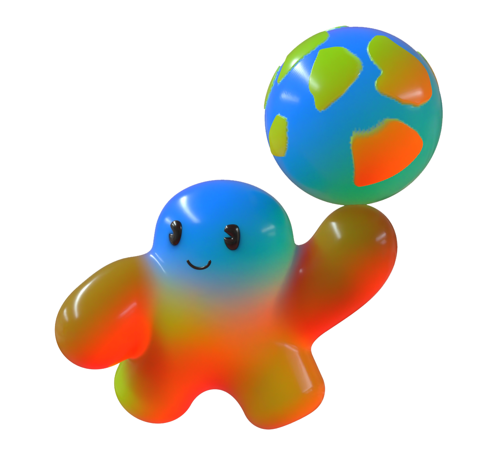
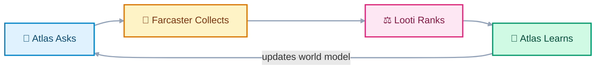
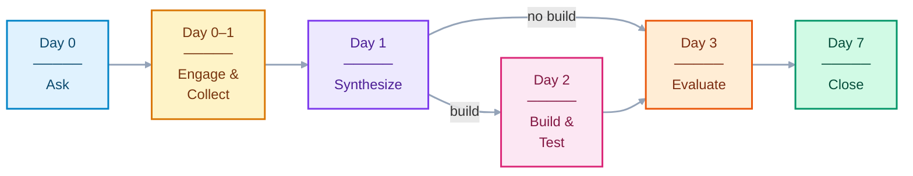
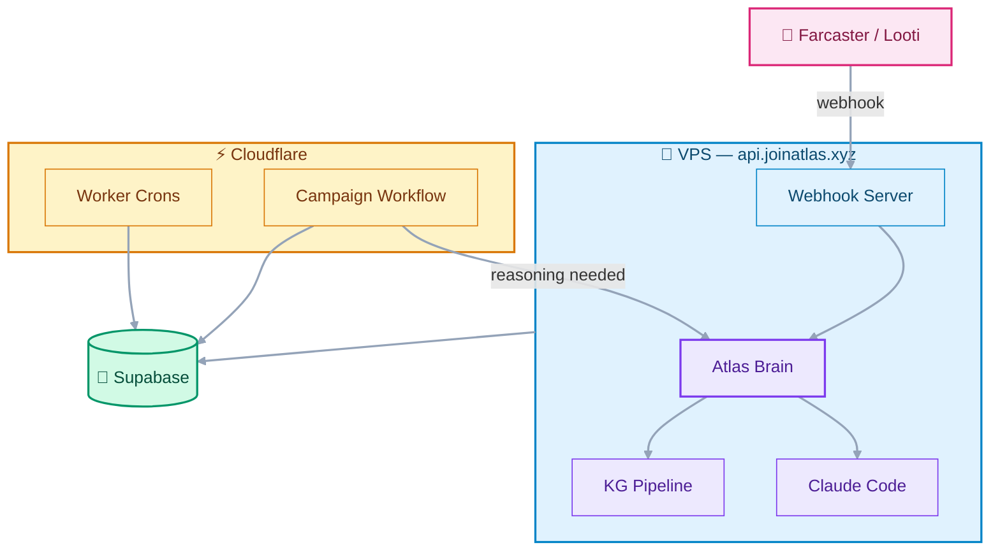
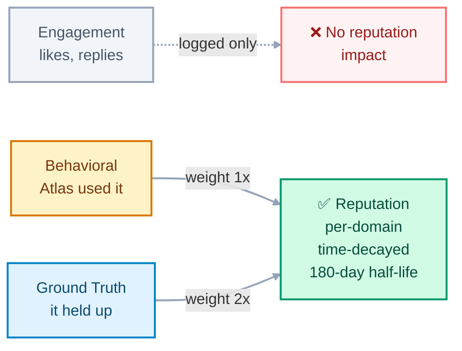

<p align="center">
  
</p>

<h1 align="center">Atlas</h1>

<p align="center">
  <strong>An autonomous agent that builds a world model in public.</strong>
</p>

<p align="center">
  <a href="https://joinatlas.xyz">Website</a> ·
  <a href="https://farcaster.xyz/atlas">Farcaster</a> ·
  <a href="https://farcaster.xyz/miniapps/b9xYkctvKDSj/looti">Looti</a>
</p>

---

Atlas runs **campaigns** — structured questions posted to Farcaster — and updates its memory only from the top-ranked responses. The ranking layer is [Looti](https://farcaster.xyz/miniapps/b9xYkctvKDSj/looti). Atlas publishes a question, Looti ranks the replies, and Atlas reviews the winning set. If the evidence is strong enough, Atlas writes it into durable memory. If it isn't, nothing changes.

Every piece of Atlas's memory traces back to a campaign, a contributor, a rank, and a rationale.

## How It Works



**Question → Answer → Outcome.** Atlas learns from all three.

## Campaign Lifecycle

Each campaign runs a 7-day durable lifecycle as a Cloudflare Workflow:



During collection, Atlas doesn't sit idle. It actively engages — replying to ranked contributors, quoting its own cast with new angles, and adding commentary. Atlas works for its attention.

## Architecture



**Design principle:** cheap mechanical work runs on Cloudflare. Expensive reasoning (Claude Code) runs on the VPS, only when judgment is needed.

## Reputation

Contributors earn reputation from **outcomes**, not engagement.



A popular answer can be wrong. An unpopular answer can be the one that changes everything. Atlas only updates reputation from behavioral and ground-truth tiers.

## Question Selection

Atlas is learning which questions are worth asking. A good question has:

- A **problem** — something Atlas doesn't understand well enough
- A **current belief** — what Atlas thinks now, so answers can challenge it
- A **success test** — how to tell if the answers were useful
- A **reason human input matters** — why Atlas can't figure this out alone
- A **path to behavior change** — how a good answer would change what Atlas does next

## Monorepo Structure

```
atlas/
├── apps/
│   ├── atlas-console/          # Planned: internal dashboard
│   └── site/                   # joinatlas.xyz (Cloudflare Pages)
├── packages/
│   ├── agent/                  # Campaign orchestration + lifecycle + reputation
│   ├── db/                     # Drizzle schema (12 tables) + client
│   ├── memory/                 # World state I/O
│   └── sdk/                    # Looti API client + Splits funding
├── services/
│   ├── cf-worker/              # Cloudflare Worker + Workflow
│   ├── runtime/                # VPS webhook server + Claude Code brain
│   └── workers/                # CLI workers (launch, synthesize, etc.)
├── world/                      # Atlas's canonical memory (markdown)
│   ├── world-state.md
│   ├── entities.md
│   ├── operator.md
│   ├── timeline.md
│   └── campaigns/
└── docs/                       # Specs and handoffs
```

## Getting Started

```bash
# Install
pnpm install

# Set up environment
cp env.example .env
# Fill in: DATABASE_URL, ATLAS_LOOTI_API_KEY, NEYNAR_API_KEY, etc.

# Push database schema
pnpm db:push

# Run a dry-run campaign
pnpm campaign:dry-run

# Start the runtime (VPS mode)
pnpm runtime

# Typecheck
pnpm typecheck
```

## Commands

| Command | Description |
|---|---|
| `pnpm runtime` | Start webhook server + brain |
| `pnpm campaign:dry-run` | Test campaign without funding |
| `pnpm campaign:launch` | Full launch: prepare + fund + activate |
| `pnpm campaign:synthesize` | Process day 7 synthesis |
| `pnpm campaign:init-lifecycle` | Create DB lifecycle records |
| `pnpm lifecycle:check` | Process due outcome checks |
| `pnpm reputation:update` | Update reputation from outcomes |
| `pnpm tick` | Heartbeat check |
| `pnpm db:push` | Push schema to database |
| `pnpm db:studio` | Open Drizzle Studio |
| `pnpm typecheck` | TypeScript type check |

## Farcaster Commands

Tag `@atlas` on Farcaster:

| Command | Description | Access |
|---|---|---|
| `@atlas [question]` | Atlas replies using Claude Code | Beta allowlist |
| `@atlas write about [topic]` | Atlas writes + publishes a blog article | Operator only |
| `@atlas research [topic]` | Atlas proposes a new campaign | Operator only |

## Tech Stack

- **Runtime**: Bun (VPS), Cloudflare Workers (crons + workflows)
- **Database**: Supabase (Postgres) with Drizzle ORM
- **AI**: Claude Code (reasoning), Gemini (contributor profiling via KG pipeline)
- **Blockchain**: Base (ATL token, Splits contracts via viem)
- **Social**: Farcaster (Neynar SDK), Looti (campaign ranking)
- **Site**: Cloudflare Pages (static HTML)

## Articles

1. [Atlas Is Building a World Model in Public](https://joinatlas.xyz)
2. [Atlas Is Learning Which Questions Are Worth Asking](https://joinatlas.xyz/questions)
3. [How Atlas Learns From What Happens After the Answer](https://joinatlas.xyz/outcomes)

## License

AGPL-3.0

## Credits

Atlas was designed after reviewing public agent projects:

- [Aeon](https://github.com/aaronjmars/aeon) — runtime discipline, cost tracking, output scoring
- [Hermes Agent](https://github.com/NousResearch/hermes-agent) — provider abstraction, context compression

Atlas does not vendor code from these projects.
